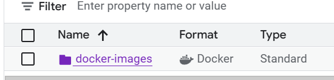
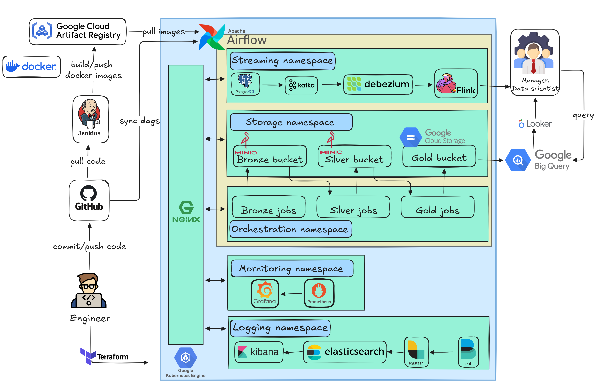
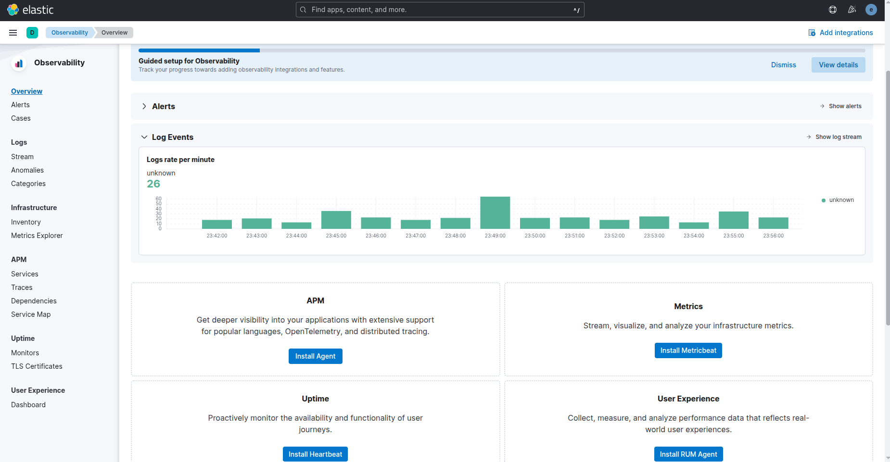

# Binance Merchant Trading Flow

> A production-grade, cloud-native data engineering platform for processing Binance C2C (Customer-to-Customer) trading data at scale

[](https://www.python.org/)
[](https://airflow.apache.org/)
[](https://flink.apache.org/)
[](https://kubernetes.io/)
[](https://cloud.google.com/)
[](https://www.terraform.io/)

---

## Table of Contents

- [Overview](#overview)
- [Architecture](#architecture)
- [Data Flow](#data-flow)
- [Tech Stack](#tech-stack)
- [Key Features](#key-features)
- [Project Structure](#project-structure)
- [Getting Started](#getting-started)
- [Deployment](#deployment)
- [Monitoring & Observability](#monitoring--observability)
- [CI/CD Pipeline](#cicd-pipeline)
- [Configuration](#configuration)
- [Airflow DAGs](#airflow-dags)

---

## Overview

This project implements a comprehensive data engineering pipeline for ingesting, processing, and analyzing Binance C2C merchant trading data. It combines batch processing and streaming processing capabilities to handle both historical data analysis and real-time event processing.

### Core Capabilities

- **Data Ingestion**: Automated data collection from Binance C2C API with configurable fetch modes
- **Batch Processing**: ETL pipelines implementing medallion architecture (Bronze → Silver → Gold layers)
- **Stream Processing**: Real-time event processing using Change Data Capture (CDC) with Kafka and Flink
- **Observability**: Comprehensive logging, monitoring, and alerting infrastructure
- **Cloud-Native**: Fully containerized and orchestrated on Google Kubernetes Engine (GKE)
- **Infrastructure as Code**: Automated infrastructure provisioning using Terraform

---

## Architecture

### High-Level System Architecture

The system is built on a microservices architecture running on Google Cloud Platform, utilizing Kubernetes for orchestration and container management.

```
┌─────────────────────────────────────────────────────────────────┐
│                    Binance C2C Trading Flow                      │
├─────────────────────────────────────────────────────────────────┤
│                                                                 │
│  ┌──────────────┐         ┌──────────────┐                      │
│  │   Batch      │         │  Streaming   │                      │
│  │  Processing  │         │  Processing  │                      │
│  └──────┬───────┘         └──────┬───────┘                      │
│         │                        │                               │
│         ▼                        ▼                               │
│  ┌──────────────────────────────────────────┐                   │
│  │     Apache Airflow (Orchestration)       │                   │
│  └──────────────────────────────────────────┘                   │
│         │                        │                               │
│         ▼                        ▼                               │
│  ┌──────────────┐         ┌──────────────┐                      │
│  │  MinIO/S3    │         │  PostgreSQL  │                      │
│  │  (Bronze)    │         │  (CDC Source)│                      │
│  └──────┬───────┘         └──────┬───────┘                      │
│         │                        │                               │
│         ▼                        ▼                               │
│  ┌──────────────┐         ┌──────────────┐                      │
│  │  Spark Jobs  │         │    Kafka     │                      │
│  │  (ETL)       │         │  (Streaming) │                      │
│  └──────┬───────┘         └──────┬───────┘                      │
│         │                        │                               │
│         ▼                        ▼                               │
│  ┌──────────────┐         ┌──────────────┐                      │
│  │  GCS (Gold)  │         │    Flink     │                      │
│  │  (Analytics) │         │  (Processing)│                      │
│  └──────────────┘         └──────┬───────┘                      │
│                                  │                               │
│                                  ▼                               │
│                          ┌──────────────┐                        │
│                          │   Telegram  │                        │
│                          │  (Alerts)   │                        │
│                          └──────────────┘                        │
│                                                                 │
└─────────────────────────────────────────────────────────────────┘
```

### Google Cloud Platform Infrastructure

The infrastructure is provisioned on Google Cloud Platform using Terraform, providing a scalable and secure foundation for the data platform.

#### GKE Cluster Architecture


*Figure 1: Google Kubernetes Engine cluster configuration and node pools*

#### Virtual Machines and Node Configuration


*Figure 2: Virtual machine instances and Kubernetes node specifications*

#### Google Artifact Registry



*Figure 3: Google Artifact Registry for Docker image storage and versioning*

#### GKE Pipeline Overview



*Figure 4: End-to-end GKE deployment pipeline*

#### Cost Analysis


*Figure 5: Average daily GCP resource usage and cost breakdown*

### Infrastructure Components

- **GKE Cluster**: Managed Kubernetes cluster with auto-scaling capabilities
- **Artifact Registry**: Centralized Docker image repository with version control
- **Cloud Storage**: Object storage for long-term data retention (Gold layer)
- **VPC Networking**: Secure network configuration with firewall rules
- **Ingress Controllers**: Nginx-based ingress for external access to services

---

## Data Flow

### Batch Processing Pipeline

The batch processing pipeline implements a medallion architecture pattern, processing data through three distinct layers:

1. **Ingestion Layer**: Fetches data from Binance C2C API and writes to MinIO landing zone
2. **Bronze Layer**: Raw data ingestion with minimal transformation, preserving source data fidelity
3. **Silver Layer**: Cleaned, validated, and enriched data with business logic applied
4. **Gold Layer**: Business-ready aggregated datasets optimized for analytics and reporting

```
Binance API → Landing (MinIO) → Bronze → Silver → Gold (GCS)
```

**Schedule**: Daily batch processing via Apache Airflow DAG

#### Batch Pipeline Architecture


*Figure 6: Complete batch processing pipeline architecture and data flow*

#### Batch Processing CI/CD


*Figure 7: Jenkins CI/CD pipeline for batch processing Docker image builds*

#### Data Storage Examples

**MinIO Bronze Bucket Data Structure**


*Figure 8: Raw data structure in MinIO bronze bucket*

**GCS Gold Bucket Data Structure**


*Figure 9: Processed analytics data in Google Cloud Storage gold bucket*

#### Batch Job Execution


*Figure 10: Successful execution of all batch processing DAG tasks*

#### Analytics and Reporting

**BigQuery Buy/Sell Analysis**


*Figure 11: Trading volume analysis by buy/sell transactions in BigQuery*

**Total VND/USDT Volume**


*Figure 12: Total trading volume metrics in VND and USDT*

**Looker Dashboard**


*Figure 13: Business intelligence dashboard in Looker Studio*

**Docker Image Verification**


*Figure 14: Batch processing Docker image in Google Artifact Registry*

### Streaming Processing Pipeline

The streaming pipeline enables real-time event processing using Change Data Capture (CDC) technology:

1. **Ingestion**: Hourly data upserts to PostgreSQL database
2. **CDC**: Debezium captures database changes and publishes to Kafka
3. **Kafka**: Event streaming platform for real-time data distribution
4. **Flink**: Stream processing engine for real-time transformations and aggregations
5. **Telegram**: Alert notifications for critical events

```
PostgreSQL → Debezium → Kafka → Flink → Telegram
```

**Schedule**: Hourly ingestion with continuous streaming processing

#### Streaming Pipeline Architecture


*Figure 15: Complete streaming processing pipeline architecture*

#### Streaming Processing CI/CD


*Figure 16: Jenkins CI/CD pipeline for streaming processing Docker image builds*

#### Streaming Execution


*Figure 17: Successful completion of streaming ingestion DAG in Airflow*

#### Kafka Topic Production


*Figure 18: Kafka topic message production and consumption metrics*

#### Telegram Notifications

**Mobile Telegram Alert**


*Figure 19: Real-time alerts delivered via Telegram mobile application*

**Desktop Telegram Alert**


*Figure 20: Real-time alerts delivered via Telegram desktop application*

---

## Tech Stack

### Core Technologies

| Category | Technology | Purpose |
|----------|-----------|---------|
| **Orchestration** | Apache Airflow | Workflow orchestration and scheduling |
| **Streaming** | Apache Flink | Real-time stream processing |
| **Messaging** | Apache Kafka | Event streaming platform |
| **CDC** | Debezium | Change data capture from PostgreSQL |
| **Batch Processing** | Apache Spark | ETL and data transformation |
| **Storage** | MinIO / S3 | Object storage (Bronze/Silver layers) |
| **Storage** | Google Cloud Storage | Long-term analytics storage (Gold layer) |
| **Database** | PostgreSQL | Transactional data store |
| **Containerization** | Docker | Application containerization |
| **Orchestration** | Kubernetes | Container orchestration |
| **Infrastructure** | Terraform | Infrastructure as Code |
| **Package Management** | Helm | Kubernetes package management |

### Observability Stack

- **Logging**: ELK Stack (Elasticsearch, Logstash, Kibana)
- **Monitoring**: Prometheus + Grafana
- **Tracing**: Jaeger (optional)

### CI/CD

- **Jenkins**: Continuous integration and deployment
- **Artifact Registry**: Docker image repository

---

## Key Features

- **Security**: Comprehensive secrets management via Kubernetes Secrets
- **Scalability**: Auto-scaling Kubernetes deployments with horizontal pod autoscaling
- **Reliability**: Built-in retry mechanisms and comprehensive error handling
- **Observability**: Full-stack logging, monitoring, and alerting capabilities
- **Automation**: Complete CI/CD pipeline with Jenkins for automated deployments
- **Infrastructure as Code**: Terraform-based infrastructure provisioning and management
- **Containerization**: All services containerized with Docker for consistent deployments
- **Modularity**: Separated services for batch processing, streaming, and data ingestion

---

## Project Structure

```
binance-merchant-trading-flow/
├── dags/                          # Apache Airflow DAGs
│   ├── daily_batch_processing_dag.py
│   └── nr_streaming_dag.py
├── dockerfiles/                   # Docker configurations
│   ├── batch-processing/          # Batch ETL jobs (Spark)
│   ├── streaming-processing/      # Flink streaming jobs
│   └── ingestion/                 # Data ingestion service
├── helm-charts/                   # Kubernetes Helm charts
│   ├── airflow_custom/            # Airflow deployment
│   ├── flink-kubernetes-operator/ # Flink operator
│   ├── strimzi-kafka-operator/    # Kafka operator
│   ├── elk/                       # ELK stack
│   ├── prometheus/                # Prometheus
│   ├── grafana/                   # Grafana dashboards
│   └── ...
├── terraform/                     # Infrastructure as Code
│   ├── cluster.tf                 # GKE cluster
│   ├── network.tf                 # VPC and networking
│   ├── storage.tf                 # GCS buckets
│   └── ...
├── src/                           # Source code utilities
├── notebook/                      # Jupyter notebooks for analysis
├── imgs/                          # Architecture diagrams
│   ├── gcp/                       # GCP infrastructure diagrams
│   ├── batch-processing/          # Batch pipeline diagrams
│   ├── streaming-processing/      # Streaming pipeline diagrams
│   ├── logging-monitoring/        # Observability diagrams
│   └── cicd/                      # CI/CD pipeline diagrams
├── Jenkinsfile                    # Jenkins CI/CD pipeline
└── README.md                      # This file
```

---

## Getting Started

### Prerequisites

- Python 3.10+
- Docker and Docker Compose
- Kubernetes CLI (`kubectl`)
- Google Cloud SDK (`gcloud`)
- Terraform >= 1.0
- Helm 3.x
- Jenkins (for CI/CD)

### Local Development Setup

1. **Clone the repository**
   ```bash
   git clone https://github.com/yourusername/binance-merchant-trading-flow.git
   cd binance-merchant-trading-flow
   ```

2. **Set up Python environment**
   ```bash
   python -m venv .venv
   source .venv/bin/activate  # On Windows: .venv\Scripts\activate
   pip install -r dockerfiles/batch-processing/requirements.txt
   ```

3. **Configure GCP credentials**
   ```bash
   gcloud auth login
   gcloud config set project YOUR_PROJECT_ID
   ```

4. **Set up Kubernetes context**
   ```bash
   gcloud container clusters get-credentials YOUR_CLUSTER_NAME --region YOUR_REGION
   ```

---

## Deployment

### Infrastructure Deployment (Terraform)

1. **Initialize Terraform**
   ```bash
   cd terraform
   terraform init
   ```

2. **Plan and apply**
   ```bash
   terraform plan
   terraform apply
   ```

### Application Deployment (Helm)

1. **Deploy Airflow**
   ```bash
   cd helm-charts/airflow_custom
   ./airflow-deployment.sh
   ```

2. **Deploy Kafka**
   ```bash
   cd helm-charts/strimzi-kafka-operator
   kubectl apply -f strimzi-kafka-operator.yaml
   ```

3. **Deploy Flink**
   ```bash
   cd helm-charts/flink-kubernetes-operator
   ./flink_deployment.sh
   ```

4. **Deploy Monitoring Stack**
   ```bash
   cd helm-charts/grafana
   ./mornitoring_deployment.sh
   ```

---

## Monitoring & Observability

### Logging Pipeline

The logging infrastructure provides centralized log collection, processing, and visualization:

- **Elasticsearch**: Distributed search and analytics engine for log storage
- **Logstash**: Log processing and transformation pipeline
- **Kibana**: Log visualization and analysis interface
- **Filebeat/Metricbeat**: Lightweight log and metric collection agents

#### Logging Pipeline Architecture


*Figure 21: Complete logging pipeline architecture with ELK stack*

#### Elasticsearch Logs


*Figure 22: Log data indexed in Elasticsearch*

#### Kibana Log Events



*Figure 23: Log event visualization and analysis in Kibana*

### Monitoring Pipeline

The monitoring infrastructure provides real-time metrics collection and visualization:

- **Prometheus**: Time-series database for metrics collection and storage
- **Grafana**: Metrics visualization and dashboard platform
- **Node Exporter**: System-level metrics collection
- **Custom Metrics**: Application-specific business metrics

#### Monitoring Pipeline Architecture


*Figure 24: Complete monitoring pipeline architecture with Prometheus and Grafana*

#### Grafana Dashboard


*Figure 25: System metrics and performance monitoring dashboard in Grafana*

### Access Dashboards

- **Airflow UI**: `http://airflow.your-domain.com`
- **Grafana**: `http://grafana.your-domain.com`
- **Kibana**: `http://kibana.your-domain.com`
- **Flink UI**: `http://flink.your-domain.com`

---

## CI/CD Pipeline

The CI/CD pipeline automates the build, test, and deployment processes for all components of the system.

### CI/CD Pipeline Architecture


*Figure 26: Complete CI/CD pipeline workflow in Jenkins*

### Pipeline Features

The Jenkins pipeline provides the following capabilities:

- **Conditional Builds**: Automatically detects changes in Dockerfiles and triggers appropriate builds
- **Multi-Stage Pipeline**: Separate build stages for batch processing, streaming processing, and ingestion services
- **Image Tagging**: Streaming images tagged with git commit SHA for version tracking
- **Artifact Registry**: Automatic push to Google Artifact Registry upon successful builds
- **GCP Authentication**: Automated GCP service account authentication for Docker registry access

### Pipeline Stages

1. **Clean Workspace**: Removes previous build artifacts
2. **Git Checkout**: Retrieves latest code from repository
3. **Docker Build**: Builds application-specific Docker images
4. **GCP Authentication**: Authenticates with Google Cloud Platform
5. **Image Push**: Tags and pushes images to Artifact Registry

---

## Configuration

### Environment Variables

Key environment variables for different services:

**Ingestion Service**
- `BINANCE_API_KEY`: Binance API key for authentication
- `BINANCE_API_SECRET`: Binance API secret for authentication
- `FETCH_MODE`: Data fetch mode (`latest` or `latest_month`)
- `ENABLE_DB_UPSERT`: Enable PostgreSQL upserts (true/false)
- `ENABLE_MINIO_WRITE`: Enable MinIO writes (true/false)
- `SLEEP_INTERVAL`: Delay between API requests (seconds)

**Batch Processing**
- `BRONZE_WRITE_MODE`: Write mode for bronze layer (`append` or `overwrite`)
- `BRONZE_CLEANUP_MODE`: Landing zone cleanup mode (`delete` or `keep`)
- `GCS_BUCKET`: Google Cloud Storage bucket name for gold layer
- `GCS_PREFIX`: Prefix for gold layer data storage
- `GCS_WORKERS`: Number of parallel workers for GCS operations
- `GCS_USE_THREADS`: Enable threaded GCS operations (true/false)

**Streaming Processing**
- `KAFKA_BOOTSTRAP_SERVERS`: Kafka broker addresses
- `FLINK_PARALLELISM`: Flink job parallelism level
- `DB_HOST`: PostgreSQL database host
- `DB_PORT`: PostgreSQL database port
- `DB_NAME`: PostgreSQL database name
- `DB_USER`: PostgreSQL database user

### Secrets Management

Secrets are managed via Kubernetes Secrets to ensure secure credential handling:

- `airflow-producer-secret`: Binance API credentials (API_KEY, API_SECRET)
- `airflow-postgres-secret`: PostgreSQL database credentials (POSTGRES_PASSWORD)
- `minio-secret`: MinIO object storage access keys (access_key, secret_key)
- `gcs-credentials`: Google Cloud Platform service account key (JSON format)

---

## Airflow DAGs

### Daily Batch Processing DAG

**DAG ID**: `daily_batch_processing`

**Schedule**: `@daily` (runs once per day)

**Description**: Complete batch processing pipeline from data ingestion to gold layer aggregation

**Tasks**:
1. `ingestion`: Fetches data from Binance C2C API and writes to MinIO landing zone
2. `bronze_jobs`: Processes raw data from landing zone to Bronze layer with partitioning
3. `silver_jobs`: Transforms Bronze data to Silver layer with data quality checks
4. `gold_jobs`: Aggregates Silver data to Gold layer for analytics and reporting

**Task Dependencies**: `ingestion → bronze_jobs → silver_jobs → gold_jobs`

### Streaming Ingestion DAG

**DAG ID**: `streaming_ingestion`

**Schedule**: `@hourly` (runs once per hour)

**Description**: Real-time data ingestion with database upserts for CDC pipeline

**Tasks**:
1. `streaming_ingestion`: Upserts latest trading data to PostgreSQL database

**CDC Flow**: PostgreSQL changes are captured by Debezium, published to Kafka, processed by Flink, and delivered via Telegram alerts

---

## Contributing

Contributions are welcome! Please follow these steps:

1. Fork the repository
2. Create a feature branch (`git checkout -b feature/amazing-feature`)
3. Commit your changes (`git commit -m 'Add some amazing feature'`)
4. Push to the branch (`git push origin feature/amazing-feature`)
5. Open a Pull Request

---

## License

This project is licensed under the MIT License - see the LICENSE file for details.

---

## Acknowledgments

- Binance for providing the C2C API
- Apache Foundation for Airflow, Flink, Kafka, and Spark
- Google Cloud Platform for infrastructure services
- The open-source community for excellent tools and libraries

---

## Contact & Support

For questions, issues, or contributions, please open an issue on GitHub.

---

**Built for scalable data engineering**
